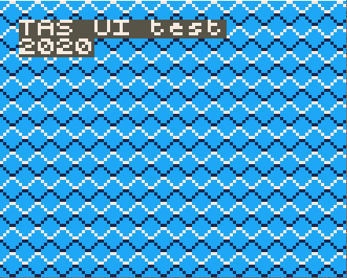

## setCursor(col, row)

## Description

Sets the cursor to the specific colum and row (using a 6x6 tilemap on the screen). The subsequent drawing functions will draw to this position. 
 
<div class="code-example" markdown="1">
**main.cpp**
</div>

```cpp
#include "Pokitto.h"
int main(){
    using PC=Pokitto::Core;
    using PD=Pokitto::Display;
    PC::begin();
    while( PC::isRunning() ){
        if( !PC::update() ) 
            continue;
        PD::print("hello world");
    }
    return 0;
}
```

<div class="code-example" markdown="1">
**My_settings.h**
</div>

```cpp
#define PROJ_SCREENMODE   MODE_HI_4COLOR
```

<div style="min-width: 33.33%">
    
</div>
